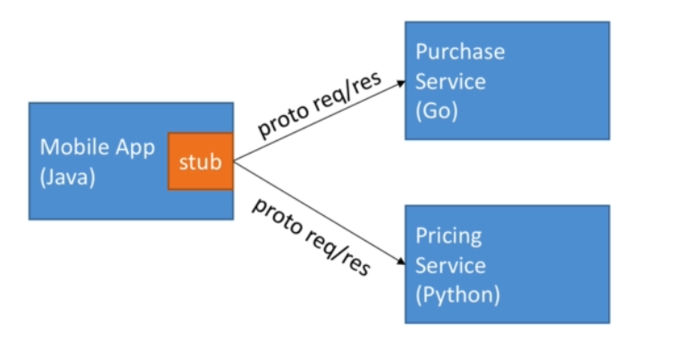
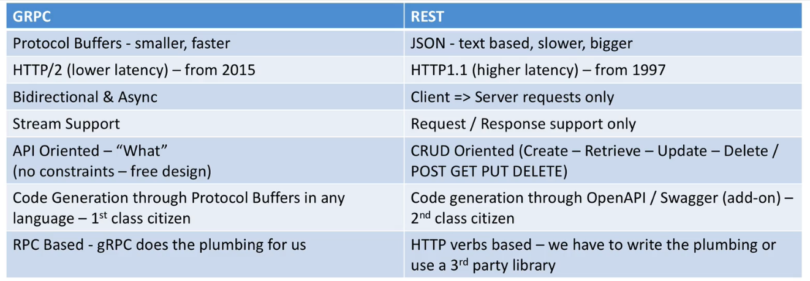

### INFORMATION

What is the gRPC 

- It is an open source framework. 

- It is the part of the CLoud Native Computation Foundation (CNCF) - like 
Docker & Kubernetes for example. 

- At a high level, it allows you to define REQUEST and RESPONSE for RPC (Remote Procedure Calls) and handles all the rest for you. 

- On top of, it is modern, fast and efficient, build on top of HTTP/2, low latency, supports streaming, language independent, and makes it super easy to plug in authentication, load balancing, logging and monitoring.

- An RPC is a Remote Procedure Call. 

- In your client code, it seems like you are just calling a function directly on the server.

- gRPC Server (Proto request and response)

- At the core of gRPC,  we need to define messages and services using protocol buffers.

- The rest of the gRPC code will be generated for you and you will have to provide an implementation for it. 

- One .proto file works for over 12 programming languages (server and client) and allows you to use a framework that scales to millions of RPC per seconds. 

### Why do we need protobuffers? 

- Protobuffers are language agnostic. 

- Data is binary and efficiently serialized (small payloads).

- Very convenient for transporting a lot of data. 

- Protocol Buffers allows for easy API evaluation using rules. 

- Protocol buffers have services(service name and RPC endpoints), messages (data request and response)

- gRPC uses Protocol Buffers for communications.

- Parsing JSON is actually CPU intensive (because the format is human readable)

- We can save Network Bandwith by using gRPC. (Less payload size)

- The payload is binary, therefore very efficient to send / receive on a network and serialize / de-serializer on a CPU. 

- gRPC leverages HTTP/2 as a backbone for communications. 

https://imagekit.io/demo/http2-vs-http1

- Microservices can interact with gRPC as below: 




### Scalability of gRPC

- gRPC servers are async by default

- This means they do not block threads on request

- Therefore each gRPC server can serve millions of requests in parallel. 

- gRPC clients can be async or sync (blocking)

- The client decides which model works best for the performance needs. 

- gRPC clients can perform client side load balancing.

- An example: Google has 10 billion gRPC request being made per second internally. 


### Security of gRPC

- By default gRPC strongly advocates for you to use SSL (encryption over the wire) in your API.

- Each language will provide an API to load gRPC with the enquired certificates and provide encryption capabilities.

- Additionally, using Interceptors, we can also provide authentication.

## Difference between REST and gRPC



## REFERENCE

Udemy - gRPC [Golang] Master Class - Build Modern API & Microservices

## Commands

```bash
go get -u google.golang.org/grpc
go get -u github.com/golang/protobuf/protoc-gen-go
```

Generate protobuf file

```bash
protoc -I=./ --go_out=./ greet/greetpb/greet.proto
``` 

